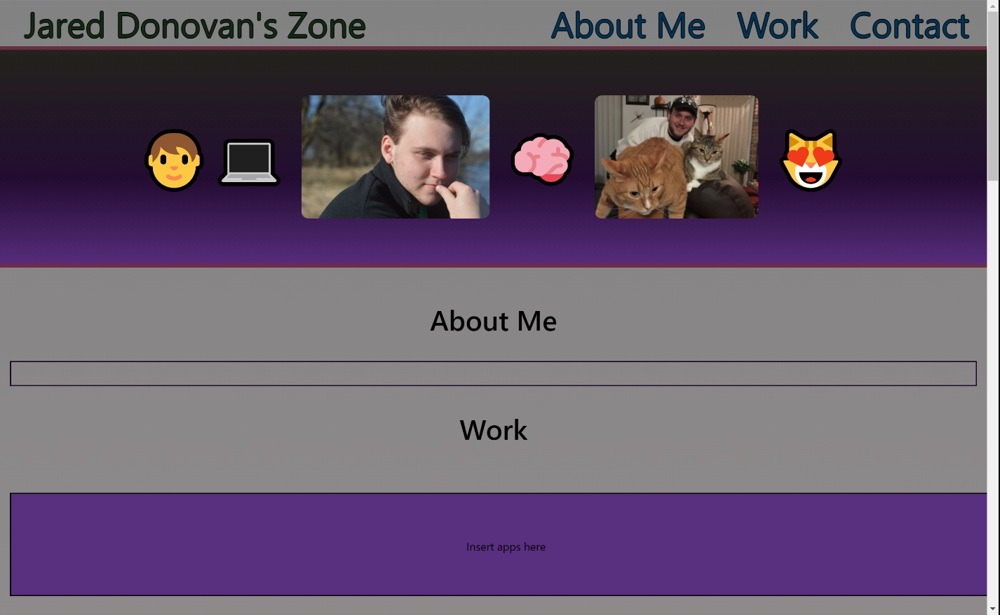

# Week 08 - Portfolio 2.0

## Deployed App

(☞ﾟヮﾟ)☞ [Check it out here!](https://jdono100.github.io/Week-08-Portfolio-2.0/)

## Description

This week for the Northwestern coding bootcamp, we have to update our professional presence by: 

1. Making a new portfolio with the skills we've learned 

2. Update our resume and insert it to our portfolio

3. Update our Github profiles to look more professional in the developer community

4. Update our LinkedIn profiles with links to the new resume and Github and add bio, list of skills, and a profile photo

## Screenshots

The following image shows the portfolio I made during week 2 of bootcamp:

And this screenshot shows my updated portfolio made 6 weeks later:

## Links

[My Github](https://github.com/jdono100)

[My LinkedIn](https://www.linkedin.com/in/jared-donovan-329712207/)
